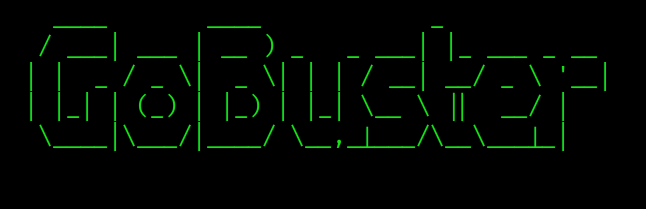

# Gobuster



<div>
<h2 id="dir">Escaneo de directorios</h2>

Este modo busca directorios y archivos en un servidor web lo realiza probando nombres de un diccionario de palabras.<br>

<b>1.- dir</b><br>

```sh
gobuster dir -u http://example.com -w /usr/share/wordlists/dirb/common.txt
```
Donde podemos agregar:<br>

<b>-x php,html,txt:Buscar archivos con extenciones especificas.</b><br>
<b>-s '200,204':Mostrar solo respestas con codigos de estado especifico.</b><br>
<b>-b '404':Ocultar respuestas con un codigo de estado especifico.</b><br>
<b>-k :Ignora si son validos o no los certificados SSL/TLS.</b><br>

<h2 id="dns">Escaneo Subdominios</h2>

Este modo realiza un ataque de fuerza bruta para encontrar subdominios consultando los registros DNS para ver si existen.

```sh
gobuster dns -d example.com -w /usr/share/wordlists/subdomains-top1million-100000.txt
```
Donde podemos agregar:<br>

<b>--wildcard: Ignorar resultados que podrian ser "comodines"</b><br>
<b>--no-error: Solo mostrar resultados exitosos.</b><br>

<h2 id="vhosts">Escaneo modo virtual</h2>

Este modo busca hosts virtuales en una direccion ip.Los hosts virtuales permiten que un solo servidro aloje multiples sitios web.

```sh
gobuster vhost -u http://example.com -w /usr/share/wordlists/dirb/big.txt
```
Donde podemos agregar:<br>

<b>--append-domain: Añade automaticamente el dominio principal.</b><br>
<b>--exclude-length <tamaño>: Ignora respuestas que tengan exactamente ese tamaño en bytes.</b><br>

<h2 id="fuzz">Escaneo modo fuzzing</h2>

Este modo activa el modo fuzzing el cual nos permite probar parametros de url,nombres de archivos etc.<br>

<b>1. Fuzzing de Extensiones de Archivos</b><br>
Si existe un archivo llamado backup pero no sabemos su terminacion podemos enumerarla con fuzz

```sh
gobuster fuzz -u http://example.com/backup.FUZZ -w /usr/share/wordlists/dirb/extensions_common.txt
```
Ejemplo de extenciones:<br>
.bak<br>
.zip<br>
.tar.gz<br>
.sql<br>


<b>2. Fuzzing de Parametros GET</b><br>
Se puede enumerar parametros ocultos como ?debug=true, ?admin=1, o parametros propicios para inyecciones LFI/SQLi

```sh
gobuster fuzz -u "http://example.com/index.php?FUZZ=test" -w /usr/share/wordlists/dirburner/common_parameters.txt
```
<b>3. Fuzzing de Valores en Parametros</b><br>
Con este modo podemos enumerar id validos dentro de una auditoria.

```sh
gobuster fuzz -u "http://example.com/profile.php?id=FUZZ" -w /usr/share/wordlists/rockyou.txt --exclude-length 240
```

<b>4. Fuzzing de Cabeceras HTTP</b><br>

Se puede enumerar diferente tipo de cabezeras con el modo fuzz de gobuster.

```sh
gobuster fuzz -u http://example.com/ -w /usr/share/wordlists/useragents.txt -H "User-Agent: FUZZ"
```

Donde Podemos agregar:<br>

<b>-m: --method <METODO> :por defecto usa get pero se puede cambiar a post.</b><br>
<b>-k:saltarte la validacion SSL HTTPS con certificados autofirmados.</b><br>
<b>-c:--cookies:agregar cookies en objetivos que pida estar autenticado. <string></b><br>
<b>-H:--headers <string>: para agregar cabezeras a nuestra peticion.</b><br>

</div>
