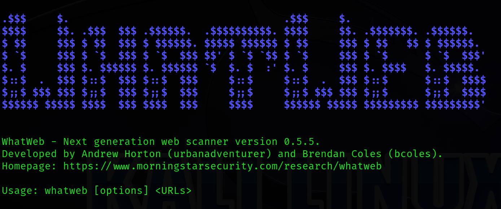

# Whatweb



<div >

<h2 id="escaneo">1.- Niveles de escaneo</h2>
El nivel de escaneo de whatweb se puede controlar bajo los soguientes parametros 

```sh
whatweb -a3 X.X.X.X
```

Donde :<br>
-a1:Este es el modo mas silencioso solo analiza la respuesta http sin hacer peticiones extra.<br>
-a3:Realiza peticiones adicionales para enumerar la version exacta de los plugins del sistema. <br>
-a4:Realiza demasiadas peticiones para enumerar por fuerza bruta todos los plugins del sistema.<br>

<h2 id="evacion">2. Evasion de bloqueos</h2>

Principalmente en este modo podemos modificar los User-agents para ids que ya bloquen por defecto la herramienta.

```sh
whatweb http://X.X.X.X -U "Mozilla/5.0 (Windows NT 10.0; Win64; x64)"
```
Donde:<br>

--user-agent : -U:Para modificar los Useragents<br>
--cookie : -c:Integrar cookies<br>
--header : -H;Modificar cabezeras<br>
<h2 id="autenticacion">3. Autenticacion</h2>
Con las banderas <b>-c</b> y <b>-H</b> podemos integrar la autenticacion en la peticion si esto asi lo necesita.

```sh
whatweb http://X.X.X.X -c "cookies" -H "cabezeras"
```
Donde:<br>

--cookie : -c:Integrar cookies<br>
--header : -H;Modificar cabezeras<br>


</div>
