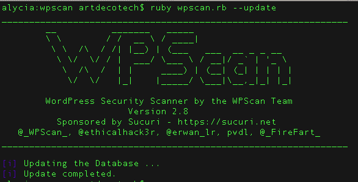

# Wpscan



<h2 id="escaneo">1.- Enumeracion</h2>
Principalmente se enfoca en la enumeracion de vulnerabilidades y enumeracion avanzada.

1.- Comando de sintaxis general enumera vulnerabilidades.
```bash
 wpscan --url https://example.com
```
2.-Enumerar usuarios legitimos detectados en el sistema
```bash
    wpscan --url https://example.com -e u
```
<h2 id="plugins">2.- Plugins y Temas</h2>

1.-Enumeracion de plugins
```bash
wpscan --url https://example.com -e vp
```
2.-Enumerar temas
```bash
wpscan --url https://example.com -e vt
```

<h2 id="plugins">3.- Configuracion</h2>

1.-WPScan requiere un Token API gratuito para mostrar detalles de vulnerabilidades:
```bash
wpscan --url https://example.com --api-token TU_API_TOKEN_AQUI
```

2.-Evasion basica de firewalls/WAF Cambio de User-Agent:
```bash
    wpscan --url https://example.com --user-agent "Mozilla/5.0 (Windows NT 10.0; Win64; x64)"
```

<h2 id="fuerza">4.- fuerza bruta</h2>

1.-Ataque usando un usuario especifico y un diccionario externo
```bash
wpscan --url https://example.com -U admin -P /ruta/tu_diccionario.txt
```
2.- Ataque combinando usuarios enumerados y un diccionario
```bash
 wpscan --url https://example.com -e u --passwords /ruta/tu_diccionario.txt
```
